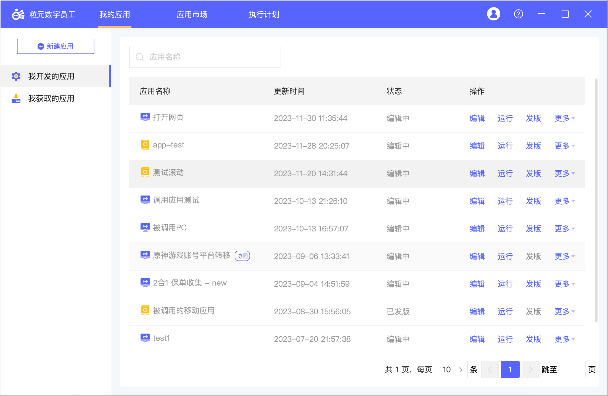

#  粒元 RPA

**粒元** 是一款面向桌面、移动设备的自动化机器人，强大易用，一切可以规则描述的设备操作都可以用粒元替代完成，它可以成为你工作、学习、生活的智能助手。自主设计的自动化语言模型

:spider_web: 官网： https://www.cxplan.cn/
:octocat: github: https://github.com/cxplan/meta_bot
:beetle:问题反馈:  https://github.com/cxplan/meta_bot/issues
:book: 开发文档: https://www.cxplan.cn/doc/

# 产品特性：

1. **多平台支持**：支持Windows、Mac、Android等设备的自动化。
2. **强大的移动自动化**：无需Root，既可以支持Android原生、web页面的自动化，支持不限于微信（基础沟通、小程序、公众号）、淘宝、京东、拼多多、闲鱼等主流应用的自动化。
3. **可视化流程设计**：无需任何代码，可见即所得，通过简单的拖拉拽，即可快速建立你的机器人应用。
4. **支持Python脚本**：可视化基础上，可以通过python表达式处理数据，同时也可以通过脚本扩展并增强自动化应用。
5. **支持应用调试**：可以单步调试指令，并可实时查看应用运行时数据。
6. **支持多人协同**：支持多人协同编辑同一应用，每一次提交都会有历史记录，适用企业的同时，对小团队也非常友好。
7. **应用共享**：基于市场，可以将应用轻松分享给需要的人，作为分享者，你可以决定谁可以下载使用，谁可以再次编辑应用。
8. **任务调度**：可以自定义触发器，为应用设定执行计划，条件满足时，自动启动运行，无需手动启动。
9. **应用互调**：支持应用之间互相调用，包括桌面应用之间，桌面应用调用移动应用。（不支持移动应用调用桌面应用）

# 截图：

# 适用场景：

**封闭系统之间的数据依赖**：向A系统提交的数据，有部分来自于系统B，但系统B没有API。典型的场景如：闲鱼的商品上传，商品获取，各大电商平台的商品信息、评价信息，以及传统的财务软件、税务申报等。

**业务数据的快速聚合**：如果所需要的数据都已经存在但分散于各个系统中，通过开发、联调、测试、发布运维，时间周期会非常长（至少需要1周以上），通过粒元RPA一般1天内即可完成第一版上线。典型的场景如：数据大盘的展示，散落在小红书、抖音、快手中的内容投放数据。

**常用的典型业务场景**：

1、电商发票管理自动化：流程覆盖用户发票需求收集、提交系统、开票，开票后将发票信息发送给用户。

2、面向人事的简历筛选自动化：自动打开Boss直聘、智联、拉勾、猎聘，逐个打开简历，自动识别简历的有效性，识别后自动执行收藏或者拒绝操作，对于优质简历主动进行打招呼以及完成基本的回应。

3、媒体内容投放与数据采集自动化：将不同版本的图文/视频内容素材，自动化发布至多平台（抖音、快手、小红书）的不同账号下，通过设置任务计划，在指定时间从不同平台采集内容素材的浏览数据，汇总至Excel或直接提交

4、......

# 功能一览：

1. 网页自动化（跨平台的网页信息抓取、信息填写，安全稳定，无法被识别）
2. 手机自动化:fire: (全网最强大易用的原生和web应用自动化)
3. 小程序自动化（桌面/移动端微信/支付宝/百度小程序的自动化，包括公众号）
4. 桌面软件自动化（桌面原生软件自动化，当前仅支持Windows，未来会支持Mac和Linux）
5. 任务计划 （当时间条件满足时，自动执行任务）
6. 鼠标键盘自动化（模拟鼠标自动点击、输入）
7. Excel/PDF自动化（自动执行Excel读写操作以及数据处理）
8. 文件/文件夹自动化（自动创建、更新、删除、读取文件/文件夹）
9. 异常处理（对错误可以捕捉并设置处理策略）
10. 支持Python（支持Python的自动化脚本）
11. 先进的元素库（便捷的元素捕捉管理，移动场景元素识别率全网最高）
12. AI识别（支持票据、卡证的识别，如身份证、火车票、车牌、发票等）
13. 应用市场（自由的共享、获取、管理自动化应用）
14. 应用开发版本化（应用指令云端化，支持多人协同，也支持不同设备的切换）
15. 调度中心（集中控制和管理RPA流程）
16. Http自动化（模拟网络请求、执行文件下载）
17. 群通知（支持企业微信、飞书、钉钉等平台的群通知）
18. 指令帮助中心（https://www.cxplan.cn/doc/）

# 最新版本：

[V1.9.2](https://github.com/cxplan/meta_bot/releases/tag/1.9.2) [2024-01-4]

# 用过都说好：

> “使用起来非常简单，而且它的功能超出了我的预期。我强烈推荐给所有人！”
>
> -- Java开发主管，Andy Liu
>
>
>
> “它不仅提高了我的工作效率，还让我能够更加轻松地完成日常任务。我真的很感激能够拥有这样一款优秀的产品。”
>
> -- 淘宝/小红书电商平台运营经理，马*妍
>
>
>
> "我一直在寻找一款能够提升工作效率的科技产品，终于让我找到了！这款 RPA 产品的功能非常强大，能够连接所有多媒体平台，和繁琐的操作说再见，而且使用起来非常方便。我已经推荐给我的同事们了，他们也非常喜欢。"
>
> -- 品牌渠道运营主管，李艳艳
>
>
>
> “作为一名开发者，让我有了努力的方向，数据抓取开发已不是难事，感觉我的收入又要增加了...”
>
> -- Python爬虫开发工程师，Edgar Li

# 联系我们：

邮箱：cxplan_rpa@163.com

企业微信：

